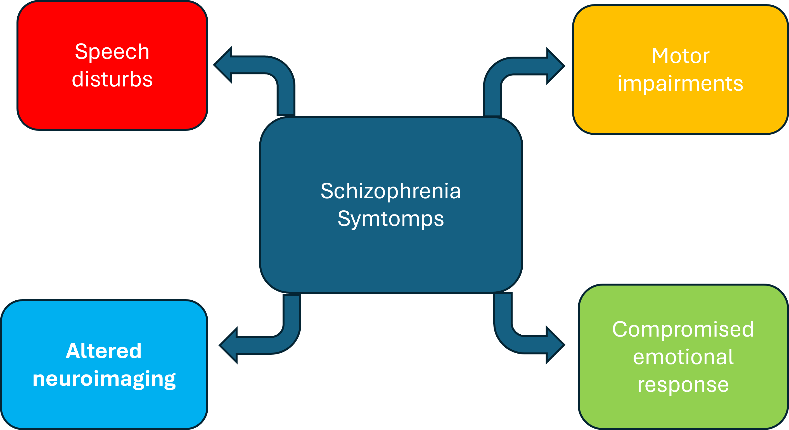
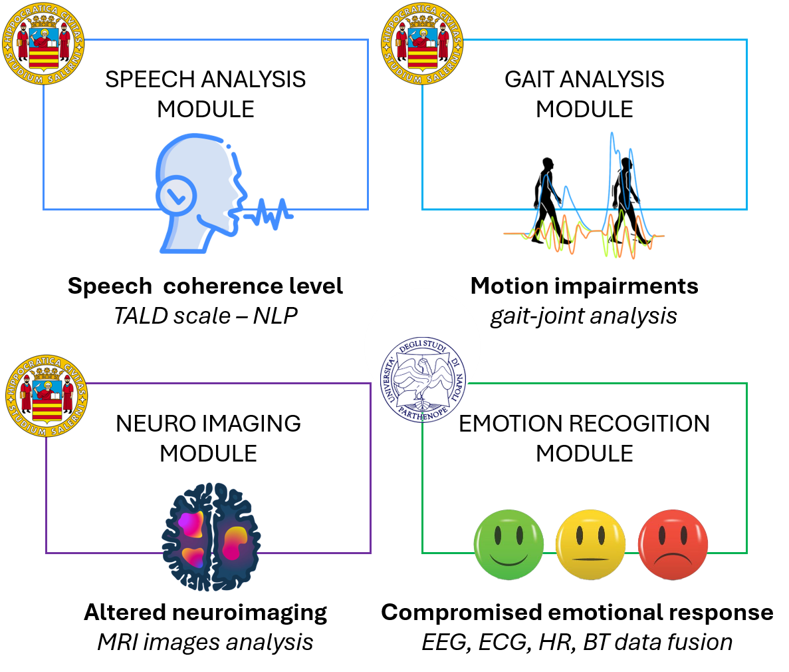
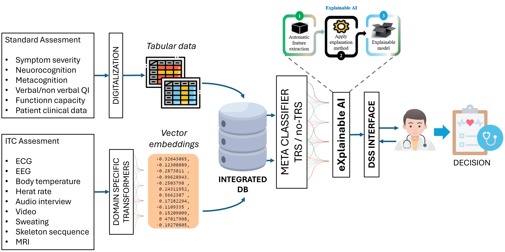
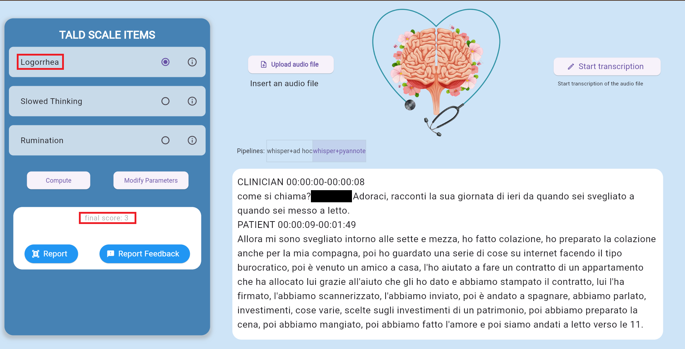
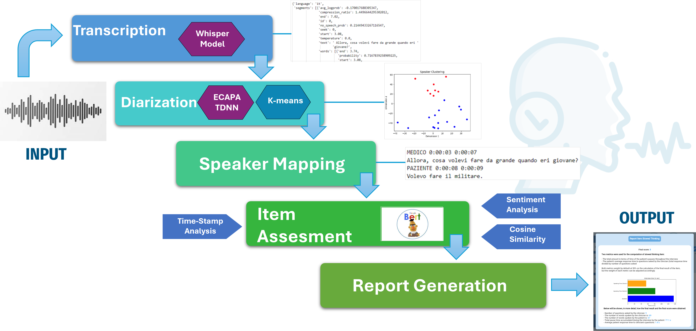
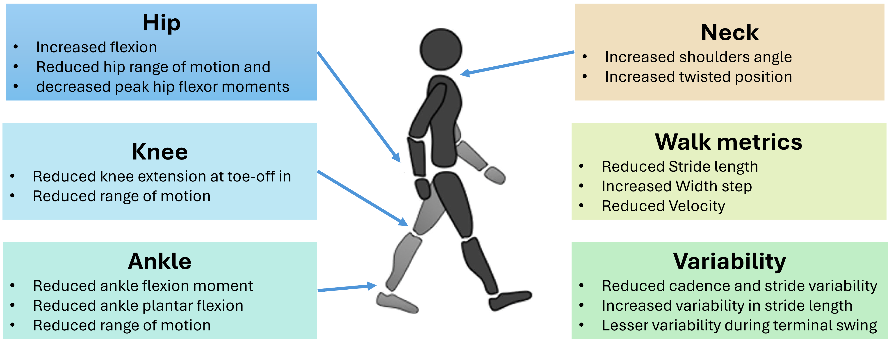
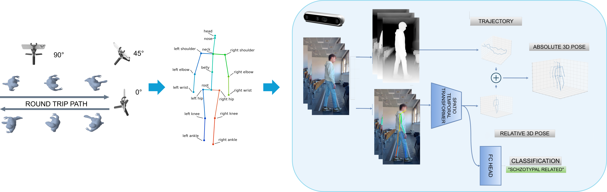
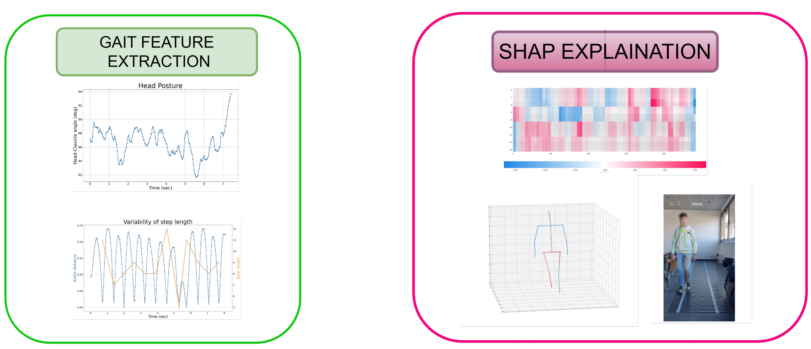
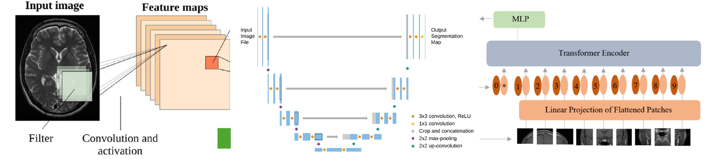
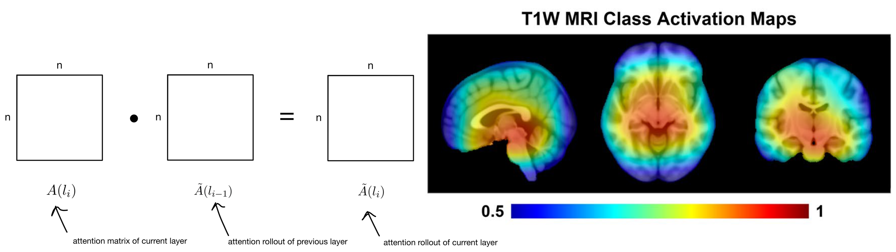

# The SPECTRA Project

**SPECTRA** (Supporting Schizophrenia Patients Care with Artificial Intelligence) is a project funded by the PNRR aimed at providing advanced diagnostic analysis tools for psychiatrists. Utilizing cutting-edge Artificial Intelligence (AI) and Explainable Artificial Intelligence (XAI) techniques, SPECTRA supports the early diagnosis of Treatment-Resistant Schizophrenia (TRS).

### Project Objectives

1. **Language**: Analyze and process linguistic data to identify language markers associated with TRS.
2. **Motion**: Analyze movement data to detect motor anomalies related to TRS.
3. **Brain Structure**: Utilize neuroimaging to identify structural brain abnormalities.
4. **Emotional Response**: Evaluate emotional responses through physiological signals.

---

## Project Overview

### The SPECTRA Project: Biomedical Data for Supporting the Detection of Treatment Resistant Schizophrenia

*Rita Francese, Felice Iasevoli, Mariacarla Staffa*

**Abstract:**

The SPECTRA project aims to support clinicians in detecting patients suffering from a specific subclass of Schizophrenia (SZ), classified as Treatment-Resistant Schizophrenia (TRS) patients. TRS patients are challenging to diagnose and experience significant difficulties. Early diagnosis can improve their quality of life. This paper describes our study on identifying the types of biomedical data necessary for training machine learning algorithms to classify TRS/non-TRS patients with schizophrenia.

### Background and Goal

Schizophrenia affects approximately 24 million people globally.  
A subset of these patients experiences treatment resistance, making early and accurate diagnosis critical.

**GOALS**:

1. **Identify TRS Patients**  
   - Collaborate with the Unit for Treatment-Resistant Psychosis at the University “Federico II” of Naples.  
   - Enroll patients categorized as TRS or non-TRS.

2. **Provide Decision Support**  
   - Deliver explanations for model outputs (Explainable AI), helping clinicians trust the black-box AI process.

### Schizophrenia Symptoms

Key dimensions of schizophrenia include:
- **Speech Disturbances**  
- **Motor Impairments**  
- **Altered Neuroimaging**  
- **Compromised Emotional Response**

---

## Methodology

The project integrates standard and IT-based assessments to analyze the main dimensions of disorganization. Each dimension has specific modules:

- **Speech Analysis Module**  
- **Gait Analysis Module**  
- **Neuro Imaging Module**  
- **Emotion Recognition Module**

---

## The SPECTRA Architecture 

### Data/Pattern Collection

1. **Standard Assessment**  
   - Symptom severity, Neurocognition, Metacognition, etc.  
   - Digitized and stored as tabular data.
2. **ITC Assessment**  
   - ECG, EEG, Temperature, Heart Rate, Interviews, Video, Sweating, Skeleton Sequences, MRI.  
   - Passed through Domain-Specific Transformers to produce embeddings.
3. **Integrated Database & Meta Classifier**  
   - Consolidates tabular data and embeddings.  
   - Determines TRS vs. non-TRS classification.

### Diagnosis Support System

1. **Meta Classifier (TRS / no-TRS)**  
2. **Explainable AI**  
3. **DSS Interface** for the clinician  
4. **Decision** (final output and interpretation)

---

## Speech Analysis

### Formal Thought Disorders

- **TALD (Thought And Language Disorder) Scale**  
  - 30 items, scored 0–4, assessing language and thought dysfunctions during clinical observation.

1. **Transcription** (Whisper Model)  
2. **Diarization** (ECAPA TDNN + K-means)  
3. **Speaker Mapping** (Time-stamp analysis)  
4. **Item Assessment** (Sentiment Analysis, Cosine Similarity)  
5. **Report Generation** (Output summary)

---

## Gait Analysis

- Examines **hip, knee, ankle, neck** movements and **walk metrics** (stride length, step width, velocity).
- Detects variability in cadence and stride, highlighting potential SZ-related motor impairments.

### Gait Analysis Methodology

1. **Multicamera Acquisition** (standard/stereo cameras)
2. **Skeleton Tracking** (MediaPipe, StackHourglass, etc.)
3. **Pattern Extraction** (Transformer-based embeddings)

### Gait Feature Extraction & Explanation

- **Feature Extraction**: Derive relevant motor features (posture, variability, step length).
- **SHAP Explanation**: Visualize how specific gait features influence classification decisions.

---

## Altered Neuroimaging

MRI (including fMRI) and structural MRI for non-invasive study of brain structure and function.

- **Aim**:  
  - Train various Deep Learning models on MRI datasets to detect SZ.  
  - Apply transfer learning on TRS vs. non-TRS patients.

### Neuroimaging Techniques

- **CNNs**: Identifying complex visual patterns in MRI.  
- **Autoencoders**: Dimensionality reduction and feature extraction.  
- **Transformers**: Sequential data analysis (fMRI).

### Explainable AI in Neuroimaging

- **Attention Rollout as Activation Map**  
  - Highlights brain regions influencing the classification decisions.

---

## Contact

For more information or inquiries:  
**Email**: [francese@unisa.it](mailto:francese@unisa.it)

---

## Repository Structure

This main README focuses on the project’s overview and visual workflow. For a detailed breakdown of code organization, refer to our repository’s branch-specific `README.md` files (e.g., `language/README.md`, `motion/README.md`, etc.), which cover the following dimensions:

1. **Speech Analysis**  
2. **Motor/Gait Analysis**  
3. **Neuroimaging**  
4. **Emotion Recognition**

---

## License and Acknowledgments

- **Funding**: PRIN PNRR 2022, European Union NextGenerationEU.  
- **Collaborating Institutions**: University of Salerno, University of Naples “Federico II,” Parthenope University of Naples.  
- **License**: For licensing details, see the [LICENSE](LICENSE) file in this repository.

Thank you for exploring **The SPECTRA Project**! We appreciate your interest and contributions. 

