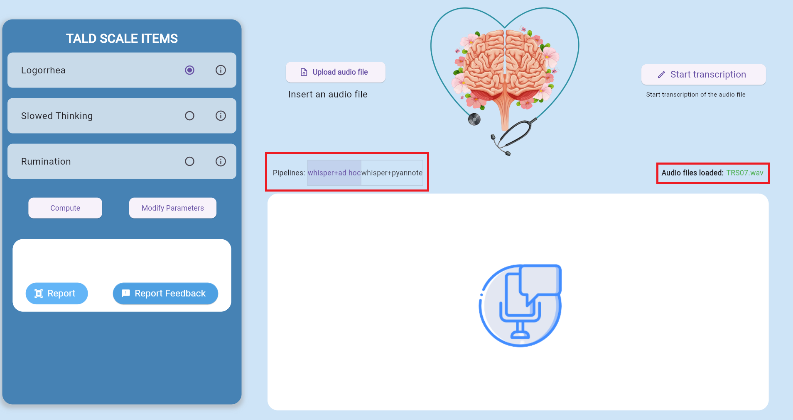
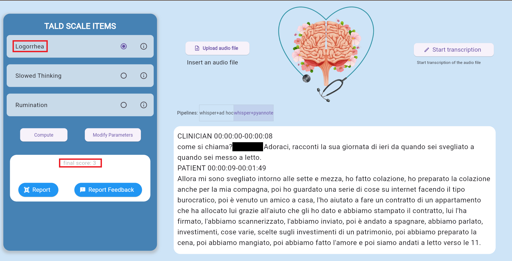
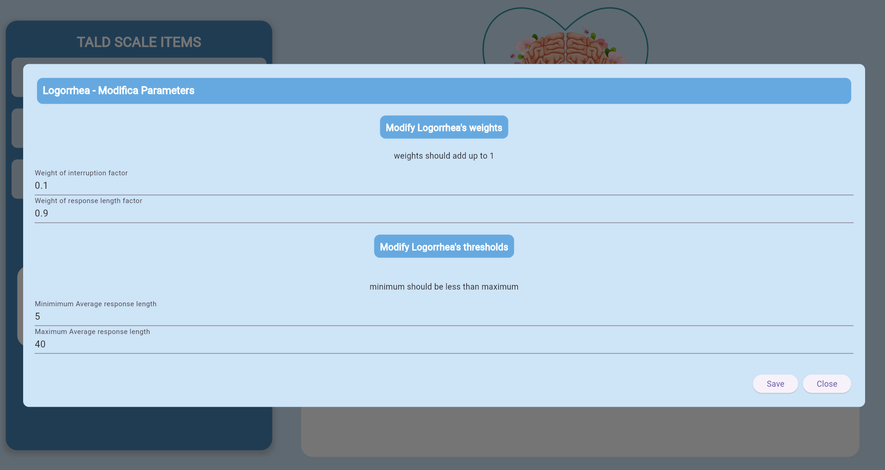
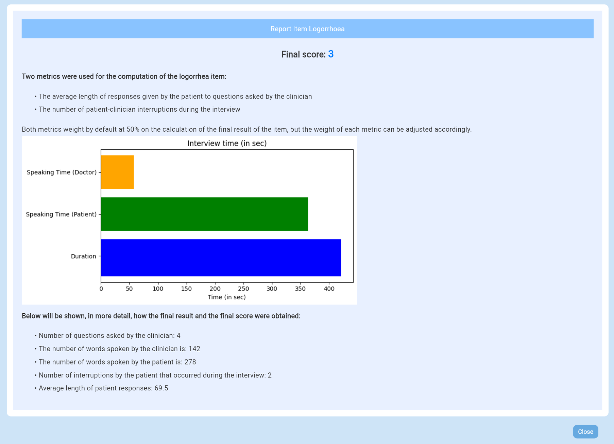

# Language Processing Module (Language Branch)

This branch contains the backend and frontend components required for processing audio data. The primary purpose of this module is to transcribe audio recordings and analyze them to compute **TALD scale items** (Thought And Language Disorder).

---

## Overview

This module supports:
- **Audio Transcription**: Generating transcripts from conversational datasets.
- **TALD Scale Analysis**: Using the transcriptions to compute key metrics for clinical evaluation.

### Structure

- **Frontend (FE)**: Handles user interaction and visualization.  
- **Backend (BE)**: Performs audio transcription, diarization, and TALD computation.  

---

## Backend Setup

1. **Python Environment**
   - Python Version: >= `3.9`
   - Required Libraries: `pyTorch v2.3.1`, `Whisper`, and `CUDA 12.1`

   Install the dependencies with the following command:
   ```bash
   pip install torch==2.3.1 torchvision==0.18.1 torchaudio==2.3.1 --index-url https://download.pytorch.org/whl/cu121
   ```

2. **Hugging Face Account**
   - Register on [Hugging Face](https://huggingface.co/) to access pre-trained models.  
   - Generate an access token from your Hugging Face account.  

3. **Required Hugging Face Repositories**
   Ensure you have access to the following repositories:
   - [pyannote/speaker-diarization](https://huggingface.co/pyannote/speaker-diarization)  
   - [pyannote/speaker-diarization-3.1](https://huggingface.co/pyannote/speaker-diarization-3.1)  
   - [pyannote/segmentation-3.0](https://huggingface.co/pyannote/segmentation-3.0)  

4. **.env File Configuration**
   Create a `.env` file in the `DeepTald_back_end` folder with the following structure:
   ```env
   REPORT_TEMPLATES="reports"
   METRICS_THRESHOLDS="config/metrics_thresholds.json"
   RECORDINGS_FOLDER="data/audios"
   TRANSCRIPTIONS_FOLDER="data/transcriptions"
   FEEDBACK_FOLDER="data"
   HF_TOKEN="INSERT YOUR TOKEN HERE"
   ```

   Replace `INSERT YOUR TOKEN HERE` with the Hugging Face token you generated.

5. **Downloading Models**
   - Navigate to `DeepTald_back_end/source/models.ipynb` and run the notebook to download pre-trained models locally.

## Using the Application

 Once everything is configured, execute the `startup.bat` file to launch the application.

The frontend allows users to interact with the audio analysis tool and visualize TALD scale results. Ensure the backend is running before interacting with the frontend components.

### Features of the Frontend Interface

1. **Audio File Upload and Transcription:**



   - Users can upload audio files directly through the interface for transcription processing.
   - The interface ensures the smooth handling of audio files, displaying the loaded files and managing potential errors.

 - **Transcription Methods:**
   - The interface supports two transcription pipelines:
     - **Whisper + Ad Hoc Diarization:** Utilizes a combination of Whisper and customized speaker diarization to provide advanced segmentation.
     - **Whisper + Pyannote:** Leverages the Whisper model paired with the Pyannote speaker diarization for precise analysis.
   - Users can select the preferred transcription method based on their needs.

2. **TALD Scale Calculation:**
   
   

   - After obtaining the transcription, the interface allows users to compute the TALD scale results for specific items such as:
     - **Logorrhea**
     - **Slowed Thinking**
     - **Rumination**
   - Results include detailed evaluations, breakdowns of contributing factors, and final scores, as seen in the reports.

3. **Adjustable Hyperparameters for Item Calculation:**


   - The interface provides options to modify hyperparameters for individual TALD items, offering flexibility in:
     - Adjusting weights for key metrics (e.g., response length and interruptions).
     - Setting thresholds for minimum and maximum response lengths.
   - This ensures personalized assessments tailored to each patient's case.

4. **Report Generation for Clinicians:**


   - The application supports the generation of detailed reports for clinicians, including:
     - Breakdown of TALD item calculations.
     - Graphical representations of speaking times and interruptions.
     - Log and summary data relevant to each session.
   - Reports are designed for professional use, ensuring accuracy and usability in clinical contexts.

---

## Usage Summary

1. Prepare the `.env` file and place it in the `DeepTald_back_end` directory.  
2. Install dependencies and configure the environment.  
3. Use the `models.ipynb` notebook to download pre-trained models.  
4. Launch the application using `startup.bat`.

---

## License and Acknowledgments

This project is part of **The SPECTRA Project**, funded by PRIN PNRR 2022. For licensing information, refer to the repository's main LICENSE file.

For inquiries, please contact the project team at [francese@unisa.it](mailto:francese@unisa.it).

