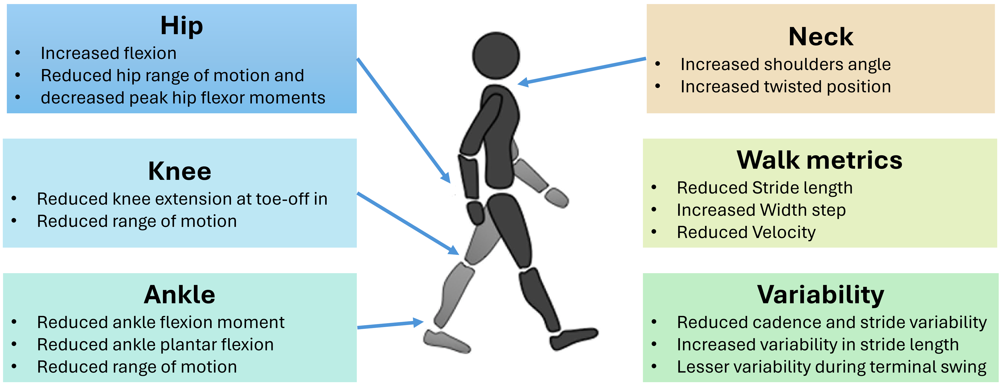
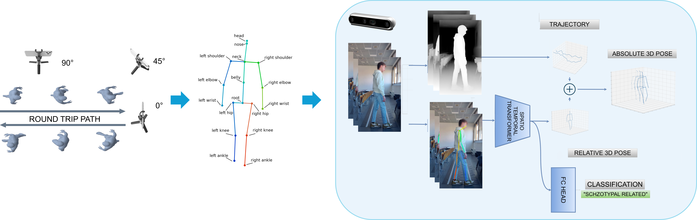
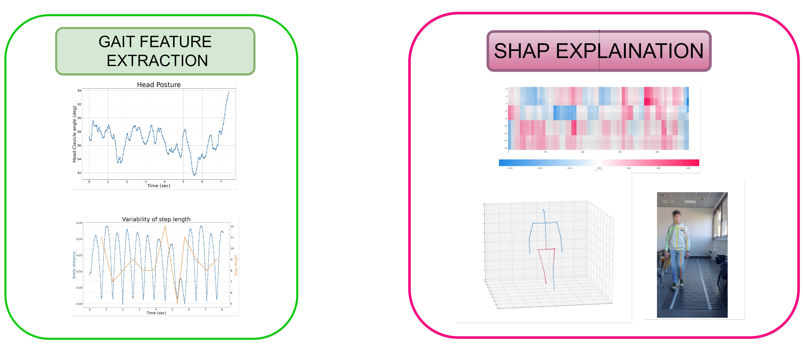

# The SPECTRA Project

**SPECTRA** (Supporting Schizophrenia Patients Care with Artificial Intelligence) is a project funded by the PNRR aimed at providing advanced diagnostic analysis tools for psychiatrists. Utilizing cutting-edge Artificial Intelligence (AI) and Explainable Artificial Intelligence (XAI) techniques, SPECTRA supports the early diagnosis of Treatment-Resistant Schizophrenia (TRS).

---

## Gait Analysis



- Examines **hip, knee, ankle, neck** movements and **walk metrics** (stride length, step width, velocity).
- Detects variability in cadence and stride, highlighting potential SZ-related motor impairments.

### Gait Analysis Methodology


1. **Multicamera Acquisition** (standard/stereo cameras)
2. **Skeleton Tracking** (MediaPipe, StackHourglass, etc.)
3. **Pattern Extraction** (Transformer-based embeddings)

### Gait Feature Extraction & Explanation



- **Feature Extraction**: Derive relevant motor features (posture, variability, step length).
- **SHAP Explanation**: Visualize how specific gait features influence classification decisions.

---

# RealSense Bag Processor

A Python tool for processing Intel RealSense D435/D455 bag files to extract color and depth frames, detect/extract 3D keypoints, and generate skeleton animations.

## Features

- Extract color (RGB) and depth frames from RealSense bag files
- Detect human keypoints using MediaPipe
- Calculate 3D coordinates with depth information
- Estimate depth error using the RMS error formula
- Calculate reliability scores for keypoints
- Apply adaptive Savitzky-Golay filtering to reduce jitter
- Generate skeleton animation videos
- Create comparison videos between original and filtered keypoints

## Requirements

- Python 3.6+
- OpenCV
- NumPy
- MediaPipe
- PyRealSense2
- SciPy
- tqdm

You can install the required packages with pip:

```bash
pip install opencv-python numpy mediapipe pyrealsense2 scipy tqdm
```

## Usage

Basic usage:

```bash
python realsense_bag_processor.py BAG_FILE OUTPUT_DIR
```

### Arguments

| Argument | Description |
|----------|-------------|
| `bag_path` | Path to the RealSense bag file |
| `output_dir` | Output directory for frames and keypoints |
| `--max-frames N` | Process only the first N frames |
| `--test` | Test mode (process only 500 frames) |
| `--filter` | Enable adaptive Savitzky-Golay filtering |
| `--filter-window N` | Base window size for the filter (default: 15) |
| `--filter-poly N` | Polynomial order for the filter (default: 2) |
| `--filter-threshold N` | Base threshold for applying the filter (default: 10.0) |

### Examples

Process the entire bag file:
```bash
python realsense_bag_processor.py recording.bag ./output
```

Process only the first 1000 frames:
```bash
python realsense_bag_processor.py recording.bag ./output --max-frames 1000
```

Test mode (500 frames):
```bash
python realsense_bag_processor.py recording.bag ./output --test
```

Apply filtering to reduce jitter:
```bash
python realsense_bag_processor.py recording.bag ./output --filter
```

Customize filter parameters:
```bash
python realsense_bag_processor.py recording.bag ./output --filter --filter-window 21 --filter-poly 3 --filter-threshold 5.0
```

## Output Structure

The script creates the following structure in the output directory:

```
output/
├── color_frames/          # Extracted color frames (PNG)
├── depth_frames/          # Extracted depth frames (PNG)
├── keypoints/             # Original keypoints (JSON)
├── keypoints_filtered/    # Filtered keypoints (JSON)
├── skeleton_frames/       # Frames with skeleton overlay
├── skeleton_frames_filtered/ # Frames with filtered skeleton overlay
├── skeleton_animation.mp4     # Video with original skeleton
├── skeleton_animation_filtered.mp4 # Video with filtered skeleton
└── skeleton_comparison.mp4    # Side-by-side comparison video
```

Each JSON file in the keypoints folders contains:
- Frame number
- Body keypoints with 3D coordinates (x, y, z)
- Depth error in millimeters
- Visibility values from MediaPipe
- Reliability scores (0-1) for each keypoint and overall frame
- Keypoint IDs corresponding to MediaPipe's naming

## Advanced Filtering

The `--filter` option enables an adaptive Savitzky-Golay filter that automatically adjusts its parameters based on keypoint quality:

- For keypoints with high jitter and low visibility, it applies a more aggressive filtering with a larger window and more rigid polynomial
- For keypoints with moderate issues, it adjusts the filter parameters proportionally
- For stable keypoints, it applies minimal filtering to preserve natural movement

This adaptive approach helps to clean up noisy keypoint data while maintaining the integrity of well-tracked movements.

## Additional Notes

- The script is optimized for Intel RealSense D435 and D455 cameras.
- All frames are automatically rotated 90 degrees.

---

## Contact

For more information or inquiries:  
**Email**: [francese@unisa.it](mailto:francese@unisa.it)

---

## License and Acknowledgments

- **Funding**: PRIN PNRR 2022, European Union NextGenerationEU.  
- **Collaborating Institutions**: University of Salerno, University of Naples “Federico II,” Parthenope University of Naples.  
- **License**: For licensing details, see the [LICENSE](LICENSE) file in this repository.

Thank you for exploring **The SPECTRA Project**! We appreciate your interest and contributions. 
