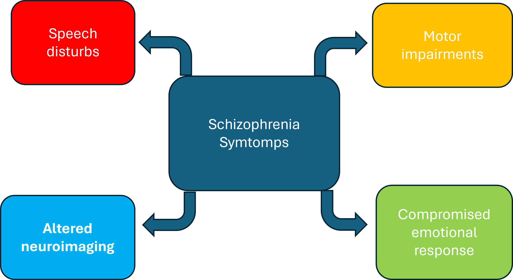
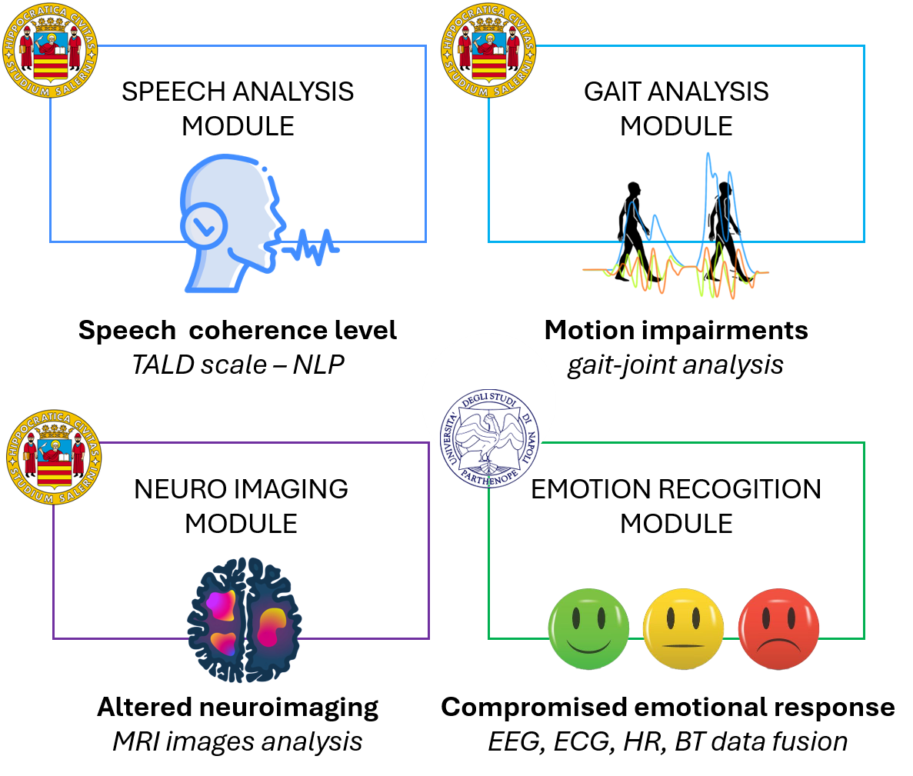
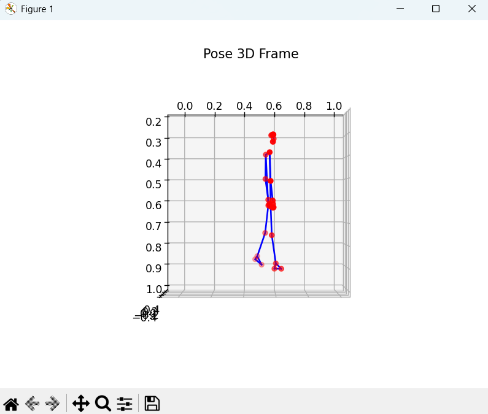

# The SPECTRA Project

**SPECTRA** (Supporting Schizophrenia Patients Care with Artificial Intelligence) is a project funded by the PNRR aimed at providing advanced diagnostic analysis tools for psychiatrists. Utilizing cutting-edge Artificial Intelligence (AI) and Explainable Artificial Intelligence (XAI) techniques, SPECTRA supports the early diagnosis of Treatment-Resistant Schizophrenia (TRS).

### Project Objectives

1. **Language**: Analyze and process linguistic data to identify language markers associated with TRS.
2. **Motion**: Analyze movement data to detect motor anomalies related to TRS.
3. **Brain Structure**: Utilize neuroimaging to identify structural brain abnormalities.
4. **Emotional Response**: Evaluate emotional responses through physiological signals.

---

## Project Overview

### The SPECTRA Project: Biomedical Data for Supporting the Detection of Treatment Resistant Schizophrenia

*Rita Francese, Felice Iasevoli, Mariacarla Staffa*

**Abstract:**

The SPECTRA project aims to support clinicians in detecting patients suffering from a specific subclass of Schizophrenia (SZ), classified as Treatment-Resistant Schizophrenia (TRS) patients. TRS patients are challenging to diagnose and experience significant difficulties. Early diagnosis can improve their quality of life. This paper describes our study on identifying the types of biomedical data necessary for training machine learning algorithms to classify TRS/non-TRS patients with schizophrenia.

### Background and Goal

Schizophrenia affects approximately 24 million people globally.  
A subset of these patients experiences treatment resistance, making early and accurate diagnosis critical.

**GOALS**:

1. **Identify TRS Patients**  
   - Collaborate with the Unit for Treatment-Resistant Psychosis at the University “Federico II” of Naples.  
   - Enroll patients categorized as TRS or non-TRS.

2. **Provide Decision Support**  
   - Deliver explanations for model outputs (Explainable AI), helping clinicians trust the black-box AI process.


### Schizophrenia Symptoms



Key dimensions of schizophrenia include:
- **Speech Disturbances**  
- **Motor Impairments**  
- **Altered Neuroimaging**  
- **Compromised Emotional Response**

---

## Methodology



The project integrates standard and IT-based assessments to analyze the main dimensions of disorganization. Each dimension has specific modules:

- **Speech Analysis Module**  
- **Gait Analysis Module**  
- **Neuro Imaging Module**  
- **Emotion Recognition Module**

---

## Gait Analysis


- Examines **hip, knee, ankle, neck** movements and **walk metrics** (stride length, step width, velocity).
- Detects variability in cadence and stride, highlighting potential SZ-related motor impairments.

### Gait Analysis Methodology


1. **Multicamera Acquisition** (standard/stereo cameras)
2. **Skeleton Tracking** (MediaPipe, StackHourglass, etc.)
3. **Pattern Extraction** (Transformer-based embeddings)

### Gait Feature Extraction & Explanation


- **Feature Extraction**: Derive relevant motor features (posture, variability, step length).
- **SHAP Explanation**: Visualize how specific gait features influence classification decisions.

---

## Implementation
The system follows a modular pipeline that processes video recordings from Intel RealSense cameras. Using **pyrealsense2**, frames are extracted, aligned, and analyzed to compute depth quality metrics. Simultaneously, **MediaPipe Pose** is used to automatically extract 3D human body keypoints, which are stored in **.json** format. A dedicated module enables animated visualization of these keypoints using **matplotlib**, producing an **.mp4** video at 60 FPS. All functions are structured modularly for easy extension and maintainability.


### Requirements
To run this project, you will need the following:
1. Python 3.8 or higher
2. pip (Python package installer)

Once you have Python installed, you can install the required dependencies by running:


```sh
pip install -r requirements.txt
```


The requirements.txt file includes the following packages:
- numpy
- opencv-python
- open3d
- pyrealsense2
- matplotlib

### Project Execution
To run the project, use the following command:

```bash
python main.py "<base_dir>"
```

- `<base_dir>` is an **optional** argument representing the base directory that contains the patient folders, each with multiple recording sessions (e.g., `.bag` files).
- If not provided, the code will use a **default path** defined internally.


Running `main.py` processes the recording sessions to extract body keypoints. During this process, corrupted or lost frames are automatically discarded, as well as frames where the number of detected keypoints falls below a predefined threshold set in the code.  
To improve keypoint extraction reliability, the system enhances ambient lighting conditions through image preprocessing techniques.  
At the same time, several quality metrics are computed (such as accuracy, noise, planarity, etc.) and compared with reference values from the official RealSense datasheet. An example of the output generated during execution:

```json
{
  "File": "20250118_121803.bag",
  "Quality measures": {
      "camera_model": "Intel RealSense D455F",
      "baseline_m": 0.095,
      "accuracy_error_mm": 7831.0,
      "rms_precision_mm": 545.213007450987,
      "fill_rate_percent": 91.8172661163522,
      "image_noise_rms": 39.03862670484196,
      "sharpness_sfn": 5790.02880684795,
      "temporal_jitter_mm": 430.09827817475497,
      "planarity_error_m": 0.003956824514231298
  }
}
```

Finally, a summary report is generated, indicating the percentage of lost frames and the proportion of the video considered valid.

```json
{
  "File": "20250118_121803.bag",
  "Frames": {
      "total_frames": 1862,
      "lost_frames": 1,
      "invalid_keypoint_frames": 36,
      "frame_loss_pct": "0.1%",
      "keypoint_loss_pct": "2.0%"
  }
}
```

The keypoints are also saved in JSON format, including the patient data extracted from the `metadati.txt` file, which is located at the same level as the patient folders containing the videos. Here’s an example:

```json
{
    "patient": {
        "ID": "2",
        "INIT": "G_B",
        "AGE": "40",
        "GENDER": "M",
        "CLASS": "SCZ15"
    },
    "frames": [
        [
            [0.4722867012023926, 0.5031165480613708, -0.043521031737327576],
            ...,
            [0.46645379066467285, 0.5044509768486023, -0.04040413349866867]
        ],
        ...
    ]
}
```

---

## Results

To visualize the results obtained from keypoint extraction, run the command:

```bash
python show_results.py "<path>"
```
In this case as well, the `<path>` parameter is optional: if omitted, a default path defined in the code will be used.
This will launch a process that reconstructs the patient’s movement in a 3D space using the extracted keypoints, with a visualization powered by Matplotlib. Additionally, a `.mp4` video of the animation will be automatically saved in the `results` directory.



---

## Contact

For more information or inquiries:  
**Email**: [francese@unisa.it](mailto:francese@unisa.it)

---

## Repository Structure

This main README focuses on the project’s overview and visual workflow. For a detailed breakdown of code organization, refer to our repository’s branch-specific `README.md` files (e.g., `language/README.md`, `motion/README.md`, etc.), which cover the following dimensions:

1. **feature/language/ -> Speech Analysis**  
2. **feature/motion/ -> Motor/Gait Analysis**  
3. **feature/neuro/ -> Neuroimaging**  
4. **feature/emotion/ -> Emotion Recognition**

---

## License and Acknowledgments

- **Funding**: PRIN PNRR 2022, European Union NextGenerationEU.  
- **Collaborating Institutions**: University of Salerno, University of Naples “Federico II,” Parthenope University of Naples.  
- **License**: For licensing details, see the [LICENSE](LICENSE) file in this repository.

Thank you for exploring **The SPECTRA Project**! We appreciate your interest and contributions. 

