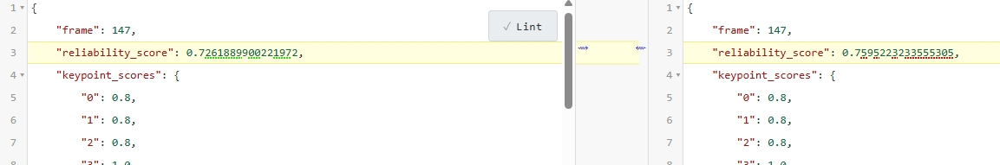
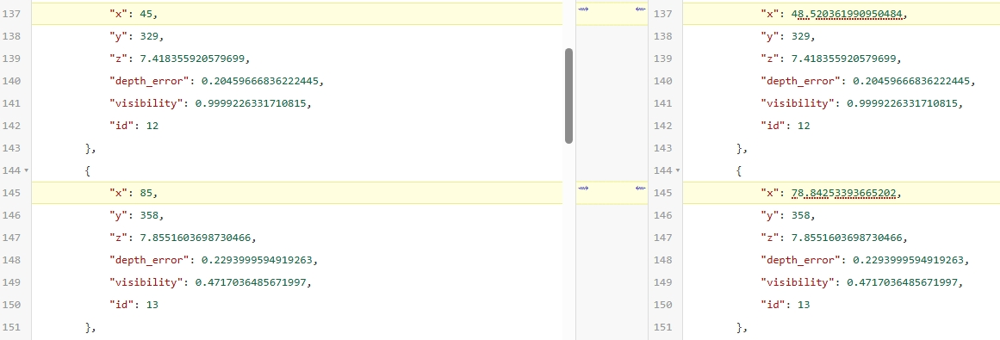
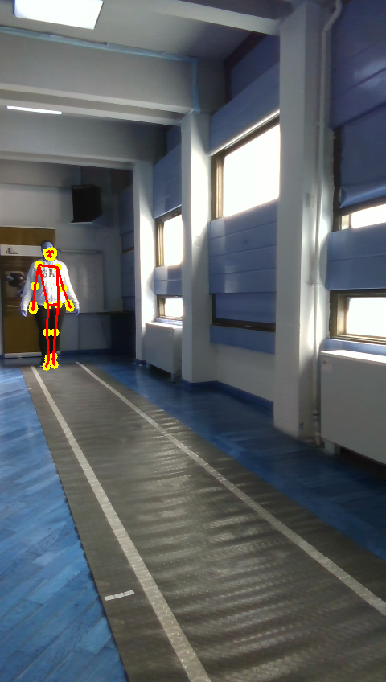

# The SPECTRA Project

**SPECTRA** (Supporting Schizophrenia Patients Care with Artificial Intelligence) is a project funded by the PNRR aimed at providing advanced diagnostic analysis tools for psychiatrists. Utilizing cutting-edge Artificial Intelligence (AI) and Explainable Artificial Intelligence (XAI) techniques, SPECTRA supports the early diagnosis of Treatment-Resistant Schizophrenia (TRS).

---

## Gait Analysis


- Examines **hip, knee, ankle, neck** movements and **walk metrics** (stride length, step width, velocity).
- Detects variability in cadence and stride, highlighting potential SZ-related motor impairments.

### Gait Analysis Methodology


1. **Multicamera Acquisition** (standard/stereo cameras)
2. **Skeleton Tracking** (MediaPipe, StackHourglass, etc.)
3. **Pattern Extraction** (Transformer-based embeddings)

### Gait Feature Extraction & Explanation


- **Feature Extraction**: Derive relevant motor features (posture, variability, step length).
- **SHAP Explanation**: Visualize how specific gait features influence classification decisions.

---

# RealSense Bag Processor

A Python tool for processing Intel RealSense D435/D455 bag files to extract color and depth frames, detect/extract 3D keypoints, and generate skeleton animations.

## Features

- Extract color (RGB) and depth frames from RealSense bag files
- Detect human keypoints using MediaPipe
- Calculate 3D coordinates with depth information
- Estimate depth error using the RMS error formula
- Calculate reliability scores for keypoints
- Apply adaptive Savitzky-Golay filtering to reduce jitter
- Generate skeleton animation videos
- Create comparison videos between original and filtered keypoints

## Requirements

- Python 3.6+
- OpenCV
- NumPy
- MediaPipe
- PyRealSense2
- SciPy
- tqdm

You can install the required packages with pip:

```bash
pip install opencv-python numpy mediapipe pyrealsense2 scipy tqdm
```

## Usage

Basic usage:

```bash
python realsense_bag_processor.py BAG_FILE OUTPUT_DIR
```

### Arguments

| Argument | Description |
|----------|-------------|
| `bag_path` | Path to the RealSense bag file |
| `output_dir` | Output directory for frames and keypoints |
| `--max-frames N` | Process only the first N frames |
| `--test` | Test mode (process only 500 frames) |
| `--filter` | Enable adaptive Savitzky-Golay filtering |
| `--filter-window N` | Base window size for the filter (default: 15) |
| `--filter-poly N` | Polynomial order for the filter (default: 2) |
| `--filter-threshold N` | Base threshold for applying the filter (default: 10.0) |

### Examples

Process the entire bag file:
```bash
python realsense_bag_processor.py recording.bag ./output
```

Process only the first 1000 frames:
```bash
python realsense_bag_processor.py recording.bag ./output --max-frames 1000
```

Test mode (500 frames):
```bash
python realsense_bag_processor.py recording.bag ./output --test
```

Apply filtering to reduce jitter:
```bash
python realsense_bag_processor.py recording.bag ./output --filter
```

Customize filter parameters:
```bash
python realsense_bag_processor.py recording.bag ./output --filter --filter-window 21 --filter-poly 3 --filter-threshold 5.0
```

## Output Structure

The script creates the following structure in the output directory:

```
output/
├── color_frames/          # Extracted color frames (PNG)
├── depth_frames/          # Extracted depth frames (PNG)
├── keypoints/             # Original keypoints (JSON)
├── keypoints_filtered/    # Filtered keypoints (JSON)
├── skeleton_frames/       # Frames with skeleton overlay
├── skeleton_frames_filtered/ # Frames with filtered skeleton overlay
├── skeleton_animation.mp4     # Video with original skeleton
├── skeleton_animation_filtered.mp4 # Video with filtered skeleton
└── skeleton_comparison.mp4    # Side-by-side comparison video
```

Each JSON file in the keypoints folders contains:
- Frame number
- Body keypoints with 3D coordinates (x, y, z)
- Depth error in millimeters
- Visibility values from MediaPipe
- Reliability scores (0-1) for each keypoint and overall frame
- Keypoint IDs corresponding to MediaPipe's naming

## Advanced Filtering

The `--filter` option enables an adaptive Savitzky-Golay filter that automatically adjusts its parameters based on keypoint quality:

- For keypoints with high jitter and low visibility, it applies a more aggressive filtering with a larger window and more rigid polynomial
- For keypoints with moderate issues, it adjusts the filter parameters proportionally
- For stable keypoints, it applies minimal filtering to preserve natural movement

This adaptive approach helps to clean up noisy keypoint data while maintaining the integrity of well-tracked movements.

## Additional Notes

- The script is optimized for Intel RealSense D435 and D455 cameras.
- All frames are automatically rotated 90 degrees.

---

## Algorithm Details

The script uses several specialized algorithms to process, calculate, and filter 3D keypoint data. Below is a detailed explanation of each key algorithm:

### 1. `get_depth_around_point`

This function retrieves robust depth values for keypoints by analyzing a small region around each point.

**Implementation:**
- Creates a 5×5 pixel window around the target keypoint
- Samples depth values from all pixels in this window
- Filters out invalid depth readings (zero or error values)
- Calculates the average of valid depth values
- Falls back to historical depth values from previous frames if no valid readings are found

**Purpose:**
This approach solves the common problem of missing or noisy depth values in RealSense depth frames, especially at object boundaries or reflective surfaces. By averaging multiple readings, it provides more reliable depth estimation even in challenging scenarios.

### 2. `calculate_depth_error`

Implements the theoretical RMS depth error formula for stereo cameras:

```
Depth RMS error(mm) = Distance(mm)² × Subpixel / (focal length(pixels) × Baseline(mm))
```
Where:
- focal length(pixels) = (1/2) × res(pixels) / tan(HFOV/2)

**Implementation:**
- Uses camera intrinsics from the RealSense device (baseline, HFOV, resolution)
- Calculates depth error in millimeters for each keypoint
- Provides error bounds for depth measurements

**Purpose:**
Understanding the error margin in depth readings is crucial for applications requiring precise 3D positioning. The error increases quadratically with distance, which this function correctly models.

### 3. `calculate_jitter_score`

Evaluates the stability and reliability of keypoints across frames.

**Implementation:**
- Tracks each keypoint's movement between consecutive frames
- Compares the current movement with the average of recent movements (up to 15 frames)
- Assigns scores from 0 (highly irregular movement) to 1 (smooth, consistent movement)
- Applies penalties for:
  - Zero depth values (unusable for 3D positioning)
  - Low visibility scores (uncertain detections from MediaPipe)
  - Sudden, inconsistent movements (potential detection errors)

**Purpose:**
This metric helps identify unreliable keypoints that might need filtering or special handling. The score can be used to weight keypoints differently in downstream applications or to trigger adaptive filtering.

### 4. `apply_adaptive_savgol_filter`

A modified Savitzky-Golay filter that adapts its parameters based on the quality of keypoint data.

**Implementation:**
- Analyzes each keypoint's history for variability and visibility
- For problematic keypoints (high variability, low visibility):
  - Increases the filter window size (up to 21 frames)
  - Reduces polynomial order (to be more rigid)
  - Lowers the threshold for intervention
- For stable keypoints, applies minimal or no filtering
- Only filters coordinates that show significant jitter

**Purpose:**
While standard filters apply the same processing to all data points, this adaptive approach preserves natural movements while aggressively smoothing only the problematic keypoints.

## About Savitzky-Golay Filtering

Savitzky-Golay is a digital smoothing filter that performs local polynomial regression on a series of values to determine the smoothed value for each point.

### How It Works

1. For each point, the filter fits a polynomial of specified order to a window of surrounding points using least-squares method
2. The central point is replaced with the value of the polynomial at that position
3. The process repeats for each point in the series

### Advantages for Keypoint Tracking

- **Preserves shape features**: Unlike simple moving averages, Savitzky-Golay preserves features like local minima/maxima and shoulder peaks
- **Handles non-uniform movements**: Can model the natural acceleration/deceleration of human movement
- **Adjustable parameters**: The window size and polynomial order can be tuned to balance between smoothing and feature preservation

### Limitations in Our Context

- **End-points handling**: The first and last few frames may have inferior filtering quality
- **Window size constraints**: A large window requires more frames and can over-smooth rapid legitimate movements
- **Polynomial constraints**: If the polynomial order is too low, it can remove actual movement features

### Our Adaptive Implementation

Our implementation addresses these limitations by:

1. Dynamically adjusting window size and polynomial order based on keypoint quality
2. Applying the filter selectively to only the coordinates showing significant jitter
3. Using the original keypoint data when filter conditions are not met
4. Processing each keypoint ID independently to account for different movement patterns

This approach ensures that stable, reliable keypoints maintain their natural motion patterns while problematic keypoints get appropriate levels of smoothing.

---

## Results

You can view some comparisons of JSON files and extracted video frames, before and after post-processing.
On the left is the original extracted file, and on the right is the filtered one.







---

## Contact

For more information or inquiries:  
**Email**: [francese@unisa.it](mailto:francese@unisa.it)

---

## License and Acknowledgments

- **Funding**: PRIN PNRR 2022, European Union NextGenerationEU.  
- **Collaborating Institutions**: University of Salerno, University of Naples “Federico II,” Parthenope University of Naples.  
- **License**: For licensing details, see the [LICENSE](LICENSE) file in this repository.

Thank you for exploring **The SPECTRA Project**! We appreciate your interest and contributions. 
